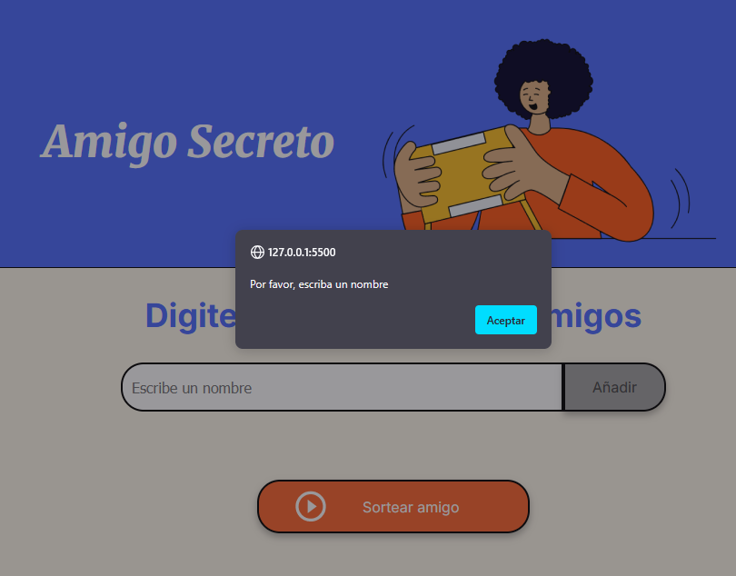
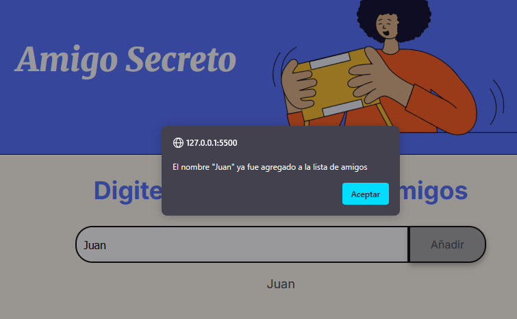
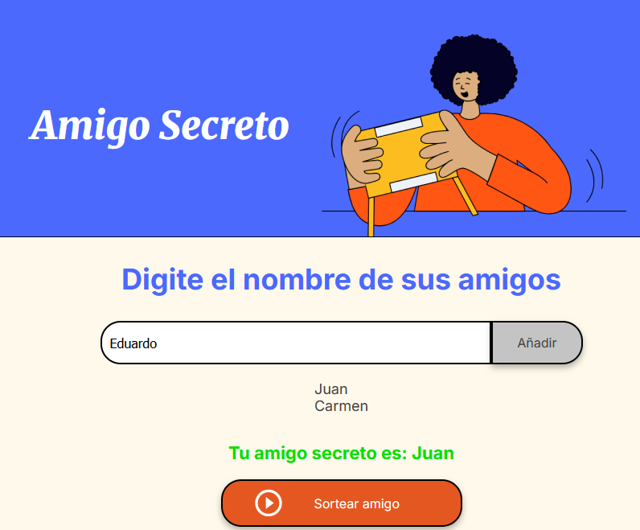

# Desafio-amigo-secreto
* Desafío amigo secreto este programa sirve para sortear un amigo secreto en un grupo
1. Al menos se debe indicar un nombre de lo contrario saldra un alert, para que se escriba un nombre como se puede ver en la imagen 
2. Se debe evitar escribir el mismo nombre dos veces de lo contrario saldra un alert seguir la imagen para ilustrar 
al añadir los nombres es necesario dar clic en sortear, esto generara su amigo secreto 
